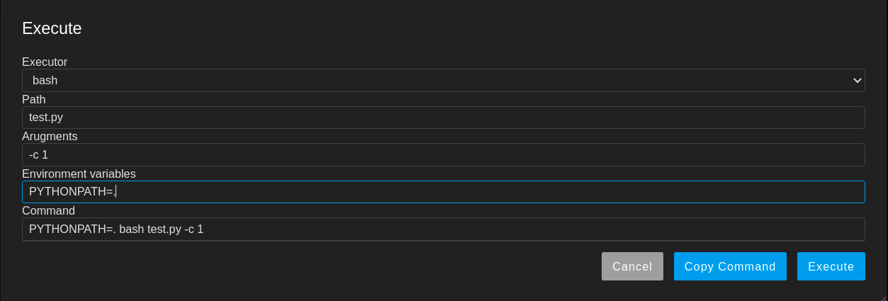

# jupyterlab-executor

[](https://pypi.org/project/jupyterlab-executor/)


JupyterLab extension of executing the scripts


The extension helps the user execute the script in the terminal and provides
multiple common executors, e.g. bash and python. Users can customise the
executors in the settings as well.

Notes: As many users are still using JupyterLab 2.x and not yet migrated 
to Jupyter 3.x, the extension supports both 2.x and 3.x until the community
is mostly moved to JupyterLab 3.x. The package version in npm may not catch
up with the PyPI version sometimes.

## Requirements

* JupyterLab >= 2.0

## Install

* For JupyterLab >= 3.0, the package can be installed via PyPI

```bash
pip install jupyterlab_executor
```

* For JupyterLab == 2.x, the package is provided only in npm

```bash
jupyter labextension install @gavincyi/jupyterlab-executor
```

## Customisation

The executors can be customised from the JupyterLab settings.


Alternatively, the customisation JSON file can be appended into the
[users setting directory](https://jupyterlab.readthedocs.io/en/stable/user/directories.html?highlight=%22jupyterlab-settings%22#jupyterlab-user-settings-directory).
The file path should be 
`$HOME/.jupyter/lab/user-settings/@gavincyi/jupyterlab-executor/executor.jupyterlab-settings` 
and the format is like the following

```
{
    "executors": [
        {
            "name": "bash",
            "command": "bash {path} {args}"
        },
        {
            "name": "python",
            "command": "python {path} {args}"
        },
        ...
    ]
}
```

The `executors` variable is a list of descriptions, of which

1. `name` is the string shown in the dialog

2. `command` is the executor command template to run, where `{path}`
is the file path returned by the content manager in the JupyterLab,
and `args` is the arguments passed in by the users.

The environment variables are always appended at the beginning of the
command. 

For example, the following execution parameters 



run the following command on the terminal

```
PYTHONPATH=. bash test.py --time 1
```

## Contributing

### Roadmap

The following features are not yet completed but on the roadmap. 

- Support script argument template

- Support default script arguments

The above features will come out very soon.

### Development install

Note: You will need NodeJS to build the extension package.

The `jlpm` command is JupyterLab's pinned version of
[yarn](https://yarnpkg.com/) that is installed with JupyterLab. You may use
`yarn` or `npm` in lieu of `jlpm` below.

```bash
# Clone the repo to your local environment
# Change directory to the jupyterlab_executor directory
# Install jupyter-packaging
pip install jupyter-packaging==0.7.12
# Install package in development mode
pip install -e .
# Link your development version of the extension with JupyterLab
jupyter labextension develop . --overwrite
# Rebuild extension Typescript source after making changes
jlpm run build
```

You can watch the source directory and run JupyterLab at the same time in different terminals to watch for changes in the extension's source and automatically rebuild the extension.

```bash
# Watch the source directory in one terminal, automatically rebuilding when needed
jlpm run watch
# Run JupyterLab in another terminal
jupyter lab
```

With the watch command running, every saved change will immediately be built locally and available in your running JupyterLab. Refresh JupyterLab to load the change in your browser (you may need to wait several seconds for the extension to be rebuilt).

By default, the `jlpm run build` command generates the source maps for this extension to make it easier to debug using the browser dev tools. To also generate source maps for the JupyterLab core extensions, you can run the following command:

```bash
jupyter lab build --minimize=False
```

### Uninstall

```bash
pip uninstall jupyterlab_executor
```

### Release

The release should follow the below steps

#### JupyterLab 3.x

1. `make clean`

2. `make venv-jupyterlab-3.x`

3. `source venv-jupyterlab-3.x/bin/activate`

4. `make release`

#### JupyterLab 2.x

1. Check out the `feature/jupyterlab-2.x-compat` branch, i.e. `git checkout feature/jupyterlab-2.x-compat`

2. Merge the main branch, i.e. `git merge main`

3. Check the `package.json` dependencies are not modified.

4. `make clean`

5. `make venv-jupyterlab-2.x`

6. `source venv-jupyterlab-3.x/bin/activate`

7. Test run, i.e. `make venv-jupyterlab-2.x`

8. `git push origin feature/jupyterlab-2.x-compat`

9. `make release-npm`
